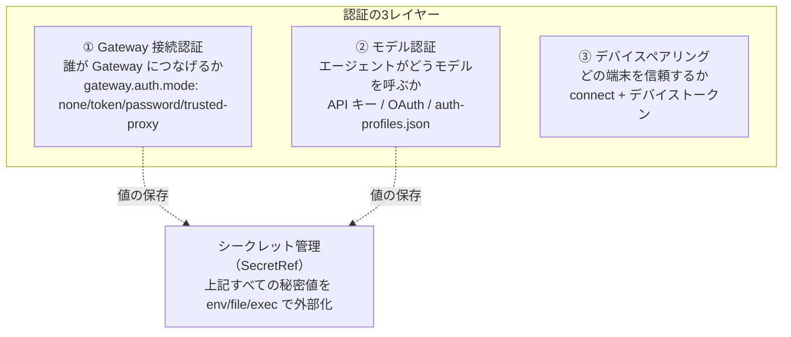

# 認証（Authentication）

OpenClaw の「認証」は紛らわしいが、**3 つの別レイヤー**に分かれている。混同するとセキュリティ事故につながるため、まずこの区別を押さえる。

## なぜ重要か

「Gateway に接続する権限」と「モデルプロバイダーを呼ぶ権限」と「端末の信頼」は**まったく別の境界**なのに、どれも "auth" と呼ばれるため混同されやすい。たとえば `gateway.auth.token`（接続認証）と OpenAI の API キー（モデル認証）は無関係で、片方を直してももう片方は解決しない。この 3 層の地図を持つことが、リモート公開・組織デプロイ・複数エージェント運用の安全設計の前提になる。

## 3 つのレイヤー

1. **Gateway 接続認証**（誰が Gateway につなげるか）：`gateway.auth.mode` ＝ `none`（共有シークレット無効、公開で使わない）/ `token`/`password`（共有シークレット）/ **`trusted-proxy`**（リバースプロキシに委任 → [[sources/gateway/trusted-proxy-auth]]）。全接続（ローカル/リモート問わず）に適用。設定は [[concepts/configuration]]。
2. **モデル認証**（エージェントがどうモデルを呼ぶか）：API キー・サブスク OAuth・Claude CLI 再利用・`auth-profiles.json` のプロファイル（→ [[sources/gateway/authentication]]）。OAuth/サブスクの詳細は [[concepts/oauth]]、適格性/理由コードの正規定義は [[sources/auth-credential-semantics]]。
3. **デバイスペアリング**（どの端末を信頼するか）：`connect` ＋デバイストークン（→ [[concepts/pairing]]）。trusted-proxy モードでは主ゲートでなくなる。

いずれの秘密値も **[[concepts/secrets]]（SecretRef）** で平文を避けて外部化できる。

## 押さえる点

- **混在禁止**：`gateway.auth.token` と `mode: "trusted-proxy"` の同時設定は起動拒否。
- モデル認証の「使う認証情報」はセッション（`/model <alias>@<profile>`）・エージェント（`auth.order`）単位で制御。
- プローブの安定理由コード（`excluded_by_auth_order`/`no_model`/`unresolved_ref` 等）で判定する（→ [[sources/auth-credential-semantics]]）。

## 関連

- [[concepts/oauth]] — モデル OAuth/サブスク認証
- [[concepts/pairing]]— デバイス信頼
- [[concepts/secrets]] / [[concepts/configuration]] / [[components/gateway]]
