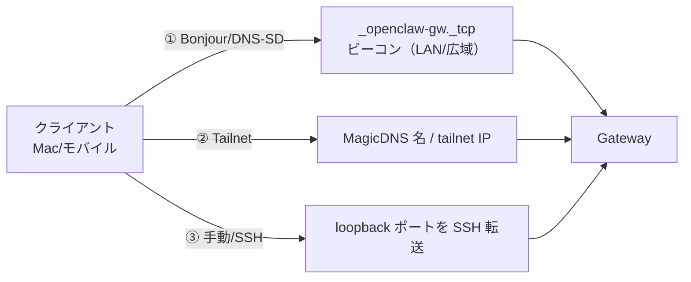

# 検出とトランスポート（Discovery & Transport）

検出（discovery, クライアントが Gateway の所在を知る手段）とトランスポート（transport, 実際につなぐ経路）は、「**クライアントがどうやって [[components/gateway]] を見つけ、どの経路で接続するか**」を扱う。設計目標は明快で、**検出・広告はすべて Gateway（`openclaw gateway`）に集約し、クライアント（Mac アプリ・モバイル [[components/node]]）は利用側に徹する**。

## 2 つのトランスポートを併存させる理由

| トランスポート | 内容 | 向き |
|---|---|---|
| **Direct WS** | LAN/tailnet 向けの Gateway WS エンドポイント（SSH 不要） | 同一ネット・tailnet で最良の UX、プロトコル面が小さく監査しやすい |
| **SSH（フォールバック）** | `127.0.0.1:18789` を SSH 転送 | SSH が通れば無関係ネット間でも動く、mDNS 問題を回避、新規ポート不要 |

WS（WebSocket）の詳細契約は [[concepts/architecture]] / [[sources/gateway/protocol]]。

## 検出入力（3 つ）

1. **Bonjour / DNS-SD**：multicast は LAN 内のみ（ベストエフォート）。広域 unicast DNS-SD でネットワーク横断も。詳細・TXT キー・セキュリティは [[sources/gateway/bonjour]]。
2. **Tailnet**：別ネット間（Bonjour が効かない）では Tailscale MagicDNS 名/安定 IP を direct ターゲットに。
3. **手動 / SSH**：direct が無い/無効なら loopback ポートを SSH 転送（運用手順は [[concepts/remote-access]]）。

**クライアントのトランスポート選択ポリシー**：①到達可能なペアリング済み direct → ②検出された Gateway をワンタップ採用 → ③設定済み tailnet direct → ④SSH フォールバック。

## 既存 wiki とのつながり

検出は「Gateway を**見つける**」、[[concepts/pairing]] は「見つけた後に**信頼を確立する**」、[[concepts/architecture]] / [[sources/gateway/protocol]] は「つないだ後の**ワイヤー契約**」——という 3 段階の入口にあたる。⚠️ **検出ヒントはトランスポートセキュリティを緩めない**：Bonjour の TXT は認証されず、モバイル Node は tailnet/public 経路に `wss://` か Tailscale Serve/Funnel を要求し、生 IP は「ルーティングヒント」であって平文 `ws://` 許可ではない（[[concepts/authentication]]・[[concepts/security]]）。

なお旧来の TCP ブリッジ（[[sources/gateway/bridge-protocol]]）は**削除済み**で、現行の検出では広告されない。

## 代表ソース

- [[sources/gateway/discovery]] — 検出入力とトランスポート選択の本体
- [[sources/gateway/bonjour]] — `_openclaw-gw._tcp` ビーコンの詳細
- [[sources/network]] — ネットワーク全体のハブ
- [[sources/gateway/bridge-protocol]] — レガシー（削除済み）

## 関連ページ

- [[concepts/pairing]] / [[concepts/architecture]] / [[concepts/authentication]] / [[concepts/remote-access]]
- [[components/gateway]] / [[components/node]]
