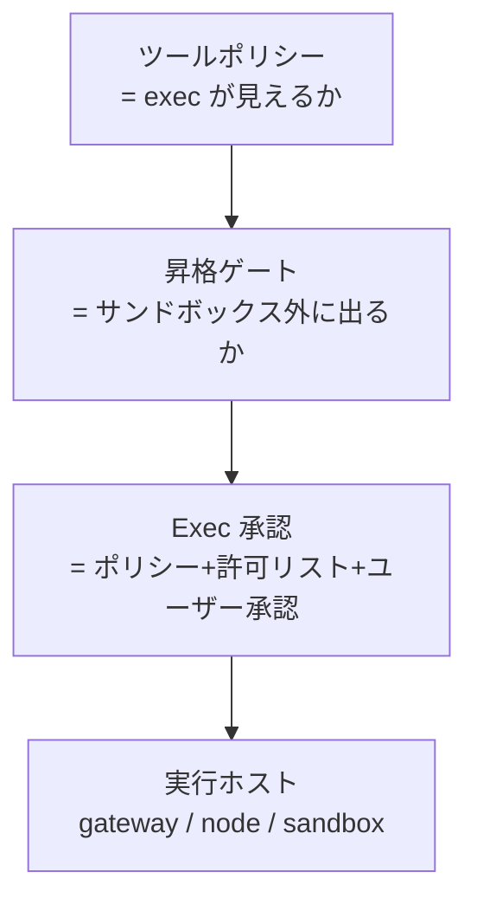

# Exec（コマンド実行）

Exec（exec, エージェントがシェルコマンドを実行する面）は、OpenClaw の「ランタイム」ツールカテゴリ——`exec`/`process`（ローカルシェル）と `code_execution`（プロバイダー側 Python）を含み、それらが**どう承認され、どこで走るか**を司る。最もリスクの高いツール面であり、承認と隔離が幾重にもかかる。

## 4 つのレイヤー（承認の重ね合わせ）

ツールポリシー（見えるか）→ **昇格**（[[sources/tools/elevated]]、サンドボックス外し）→ **Exec 承認**（[[sources/tools/exec-approvals]]、ポリシー＋許可リスト＋ユーザー承認）→ 実行ホスト。これは [[concepts/sandboxing]] の「3 制御」を実行時に具体化したもの（昇格が `full` なら承認スキップ）。

## なぜ重要か

実マシン上でシェルを叩けることはエージェントの力の源泉であり、同時に最大の危険。⚠️ **`exec` は読み取り専用にならない**——`write`/`edit` を無効化してもファイルを変更できる。だから [[concepts/security]]・[[concepts/threat-model]] は exec を「変更可能なシェル面」とみなし、[[concepts/http-api]] の `/tools/invoke` では `exec`/`spawn`/`shell` をハード拒否する。承認をどう設計するかが、エージェントを安全に使えるかを決める。

## 仕組み（要点）

- **`exec`/`process`**：ローカルシェル実行（フォア/バックグラウンド）。`host=auto|sandbox|gateway|node`（[[components/node]] のノードホストへ転送可）。詳細 [[sources/tools/exec]]。
- **Exec 承認**：`exec.security`（deny/allowlist/full）・`exec.ask`（off/on-miss/always）・エージェントごと allowlist（`argPattern`）。**YOLO モード**＝full＋ask off。承認は `~/.openclaw/exec-approvals.json` に保存し、正規 `systemRunPlan` にバインド。高度な safe bins/承認転送は [[sources/tools/exec-approvals-advanced]]。
- **`code_execution`**：xAI Responses API のリモート Python（ローカルとは認可境界が別、[[sources/tools/code-execution]]）。

## 既存 wiki とのつながり

Exec は [[concepts/sandboxing]] と表裏（サンドボックスが「どこで」、exec 承認が「許すか」）。`host=node` は [[components/node]] のノードホスト、[[components/gateway]] が承認フローを仲介する。セッション上書きは [[concepts/slash-commands]] の `/exec`/`/elevated`。

## 代表ソース

- [[sources/tools/exec]] — exec/process ツール
- [[sources/tools/exec-approvals]] / [[sources/tools/exec-approvals-advanced]] — 承認システム
- [[sources/tools/elevated]] — サンドボックス脱出 / [[sources/tools/code-execution]] — リモート Python

## 関連ページ

- [[concepts/sandboxing]] / [[concepts/security]] / [[concepts/threat-model]] / [[concepts/session-tool]]
- [[components/node]] / [[components/gateway]] / [[concepts/slash-commands]]
- 📝 ブログ告知（二次資料）：`ask`/`YOLO` の中間 `tools.exec.mode: "auto"`（reviewer-first 承認）→ [[articles/safer-than-yolo-auto-mode-for-exec-approvals]]
