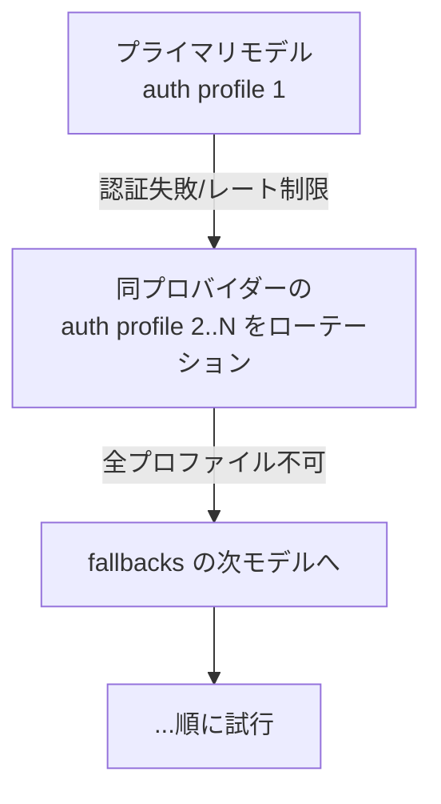

# モデルフェイルオーバー（Model Failover）

モデルフェイルオーバー（model failover, モデル/認証が失敗したときに別へ切り替えて応答を続ける仕組み）は、OpenClaw が**止まらない**ための耐障害性。失敗を 2 段階で処理する：①現プロバイダー内での**認証プロファイルのローテーション**、②`agents.defaults.model.fallbacks` の**次モデルへのフォールバック**。

## 2 段階の流れ

## なぜ重要か

API はレート制限・課金切れ・障害で落ちる。パーソナルアシスタントが「Anthropic が混んでいるので返せません」で止まっては困る。フェイルオーバーは、複数の認証アカウントと複数モデルのチェーンを用意することで、**1 つが落ちても会話を継続**させる。[[concepts/retry]]（HTTP リクエスト単位の再試行）の一段上で、モデル/認証の単位で切り替える。

## 仕組み（要点）

- **認証ローテーション**：同プロバイダーの複数プロファイル（API キー/OAuth、[[concepts/oauth]]）を順に試す。プロファイル ID・ローテーション順・**セッションの固定性**（キャッシュに優しく、同セッションは同プロファイルを保つ）。OpenAI Codex サブスク＋API キーバックアップの組み合わせ等。
- **クールダウン**：失敗したプロファイル/モデルを一定時間スキップ。**請求による無効化**（課金切れ検知）でクールダウン。
- **モデルフォールバック**：`fallbacks` チェーンを進める。「進めるエラー/継続するか/しないか」の条件、クールダウンのスキップとプローブ。
- **セッション上書き**：`/model`（[[concepts/slash-commands]]）でライブ切り替え（実行中はクリーンな再試行点で適用）。失敗サマリーで可観測性。

## 既存 wiki とのつながり

フェイルオーバーは [[concepts/model-providers]] の認証/モデル設定の上で動く。[[concepts/local-models]] の「ホスト型 primary・ローカル fallback」や逆も同じ仕組み。一時的な HTTP エラーの吸収は [[concepts/retry]]、サブスク認証の管理は [[concepts/oauth]]。

## 代表ソース

- [[sources/concepts/model-failover]] — ランタイムフロー・認証ローテーション・クールダウン・フォールバック規則

## 関連ページ

- [[concepts/model-providers]] / [[concepts/retry]] / [[concepts/oauth]] / [[concepts/local-models]]
- [[components/gateway]] / [[concepts/slash-commands]]
