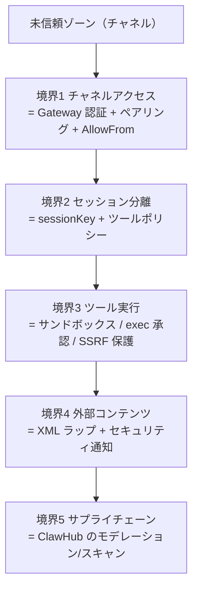

# 脅威モデル（Threat Model）

脅威モデル（threat model, システムへの敵対的脅威を体系化した分析）は、OpenClaw と ClawHub（スキルマーケットプレイス）への攻撃を **MITRE ATLAS**（AI システム向けの敵対的脅威フレームワーク）で整理し、さらに一部の不変条件を **TLA+/TLC で機械検証**するコミュニティ保守の取り組み。

## security との関係（攻める側 / 守る側）

[[concepts/security]] が「どう設計し・どう強化するか（守る側）」なら、threat-model は「**どこをどう攻められるか（攻める側）**」。両者は表裏で、threat-model の各脅威は security/[[concepts/sandboxing]]/[[concepts/pairing]]/[[concepts/http-api]] の具体的な防御に対応づく。

## 5 つの信頼境界

各境界は本 wiki の概念に対応する：①[[concepts/authentication]]・[[concepts/pairing]]、②[[concepts/session]]・[[concepts/multi-agent]]、③[[concepts/sandboxing]]・[[sources/security/network-proxy]]（SSRF）、④外部コンテンツの untrusted ラップ、⑤[[components/clawhub]]（スキル/Plugin 供給網。[[components/plugin-system]] のバンドルの狭い信頼境界もここ）。

## 主要な脅威カテゴリと最上位リスク

ATLAS の戦術別（偵察/初期アクセス/実行/永続化/防御回避/発見/持ち出し/影響）に脅威 ID を割り当てる。**最上位（P0）**は：

- **直接プロンプトインジェクション**（T-EXEC-001）— 検出のみでブロックなし＝残余リスク重大。
- **悪意ある Skill の公開**（T-PERSIST-001）— ClawHub のサンドボックス化が限定的でエージェント権限で動く。
- **認証情報の収集**（T-EXFIL-003）— Skill が環境変数/設定を読む。

代表的攻撃チェーンは「悪意ある Skill 公開→モデレーション回避→認証情報収集」と「プロンプトインジェクション→exec 承認バイパス→コマンド実行」。詳細な T-XXX 表・リスクマトリクスは [[sources/security/threat-model-atlas]]。

## 形式検証（機械検証された論拠）

[[sources/security/formal-verification]] は、Gateway 公開・Node 実行パイプライン・ペアリングストア・受信ゲーティング・ルーティング分離といった**セキュリティ不変条件**を TLA+/TLC で検証し、否定モデルでバグを再現する。⚠️ ただし「モデルであって実装全体の証明ではない」——状態空間と環境前提の範囲内の保証。

## なぜ重要か

パーソナルアシスタントは「信頼できる人間のように振る舞う」ため、攻撃者は**人間を騙す手口（プロンプトインジェクション・なりすまし・汚染コンテンツ）**でエージェントを操ろうとする。脅威モデルはこの新しい攻撃面を ATLAS という共通言語で可視化し、防御（[[concepts/security]]）の優先順位を与える。貢献の回し方は [[sources/security/contributing-threat-model]]。

## 代表ソース

- [[sources/security/threat-model-atlas]] — ATLAS 脅威モデル本体（5 境界・脅威・リスク）
- [[sources/security/formal-verification]] — TLA+/TLC によるセキュリティ回帰
- [[sources/security/contributing-threat-model]] — 貢献ガイド

## 関連ページ

- [[concepts/security]] / [[concepts/sandboxing]] / [[concepts/pairing]] / [[concepts/http-api]]
- [[concepts/local-models]]（フィルター不在のリスク） / [[components/gateway]] / [[components/clawhub]]（サプライチェーン境界）
- 📝 ブログ告知（二次資料）：T-PERSIST-001 への対策＝SkillSpector/ClawScan → [[articles/openclaw-nvidia-skill-security]]、exec 承認バイパスへの `auto` レビュアー → [[articles/safer-than-yolo-auto-mode-for-exec-approvals]]
