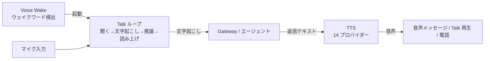

# 音声（Voice）

音声（voice, 話して聞く対話）は OpenClaw を「テキストだけのアシスタント」から「**聞いて・考えて・話す**コンパニオン」にする機能群。3 つの部品から成る：**Talk**（継続的な音声会話ループ）、**TTS**（Text-to-Speech, 返信の音声化）、**Voice Wake**（ウェイクワードでの起動）。

## 全体像

- **Voice Wake**（[[sources/nodes/voicewake]]）：ウェイクワードを **Gateway が所有する単一グローバルリスト**として管理（ノードごとのカスタムなし）。トリガー→エージェント/セッションのルーティングも持つ。
- **Talk**（[[sources/nodes/talk]]）：聞く→文字起こしをモデルへ→応答→`talk.speak` で読み上げ、の継続ループ。ネイティブ（macOS/iOS/Android）とブラウザー（[[components/control-ui]] の Talk）、`realtime`/`stt-tts`/`transcription` のモード。発話割り込み既定オン。
- **TTS**（[[sources/tools/tts]]）：返信を 14 プロバイダーで音声化。Talk の読み上げ側であると同時に、チャネル返信の音声メッセージとしても単独で機能。

## なぜ重要か

音声は「歩きながら」「手が離せないとき」にエージェントを使える最も自然なインターフェースであり、[[concepts/messages]] のテキストパイプラインと**同じセッション・同じ認証・同じツールポリシー**の上に乗る点が OpenClaw らしい——Talk のツール呼び出しは `openclaw_agent_consult` 経由で [[concepts/multi-agent]] のポリシーを通り、ブラウザーには標準 API キーでなく一時セッション資格情報のみが渡る（[[concepts/threat-model]]）。

## 入力（理解）との対比

音声の「聞く」側のうち、**ボイスメモ（非リアルタイムの音声ファイル）の文字起こし**は [[concepts/media-understanding]] が担う。本ページは主に**リアルタイムの会話ループと音声出力**を扱う——両者は連続していて、Talk の文字起こしプロバイダーとメディア理解の STT は重なる。

## 既存 wiki とのつながり

TTS/Talk のプロバイダー選択は [[concepts/agent-runtimes]] の provider 層に乗り、ウェイクワードを [[components/gateway]] に集約する設計は [[concepts/pairing]] と同じ「Gateway を信頼できる情報源にする」思想。返信先頭の JSON 音声ディレクティブは Talk と TTS で共通。

## 代表ソース

- [[sources/nodes/talk]] — Talk の会話ループ・モード・realtime 設定
- [[sources/tools/tts]] — 14 プロバイダーの音声合成・ペルソナ・チャネル別出力
- [[sources/nodes/voicewake]] — Gateway 所有のウェイクワードとルーティング

音声は Plugin（[[components/plugin-system]]）でさらに外へ広がる：**電話通話**は [[sources/plugins/voice-call]]（Twilio/Telnyx/Plivo・全二重リアルタイム）、**Google Meet 会議参加**は [[sources/plugins/google-meet]]（文字起こし→エージェント応答→TTS）。

## 関連ページ

- [[concepts/media-understanding]] — ボイスメモの文字起こし（入力側）
- [[concepts/messages]] / [[concepts/agent-runtimes]] / [[concepts/multi-agent]]
- 拡張：[[sources/plugins/voice-call]] / [[sources/plugins/google-meet]] / [[components/plugin-system]]
- [[components/node]] / [[components/gateway]]
