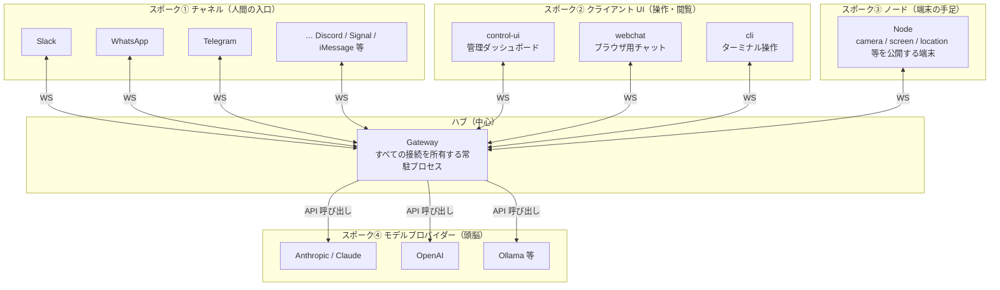

# 02. 核：Gateway 中心のハブ＆スポーク

> 前へ ← [[lecture-architecture-01-what-is-openclaw]] ｜ 次へ → [[lecture-architecture-03-message-flow]]

OpenClaw のアーキテクチャは一言でいうと **ハブ＆スポーク（hub-and-spoke, 中心のハブに全部が放射状でつながる自転車の車輪のような形）**です。中心（ハブ）に **ゲートウェイ（Gateway）**、その周りの放射（スポーク）に、入口・UI・端末・頭脳がぶら下がります。

## たとえ：オフィスの「中央受付」

ゲートウェイは、**ビルの中央受付**のようなものです。

- 来客（チャットからのメッセージ）は、必ず受付を通る。直接フロアには入れない。
- 受付は内線（後述の Node やクライアント）に取り次ぐが、**誰を通すか・どこに繋ぐかを受付が決める**。
- 受付が 1 か所だから、**入退館の記録もセキュリティチェックもそこ 1 か所で効く**。

「受付を 1 つにする」＝「**制御点（コントロールポイント）を 1 つにする**」。これがハブ＆スポークの最大の狙いです。

## 全体図

## スポークの 4 種類

中心のゲートウェイに、性質の違う 4 種類のものがぶら下がります。

| スポーク | 何者か | 例 |
|---|---|---|
| **① チャネル** | 人間が話しかけてくる入口 | [[concepts/channel-routing]]（Slack / WhatsApp / Telegram …） |
| **② クライアント UI** | 人間がゲートウェイを操作・閲覧する画面 | [[components/control-ui]]（管理）/ [[components/webchat]]（チャット）/ [[components/cli]]（端末） |
| **③ ノード（Node）** | カメラ・画面・位置情報などを公開する**端末側の手足** | [[components/node]] |
| **④ モデルプロバイダー** | 実際に考える**頭脳**（外部 AI） | [[concepts/model-providers]]（Anthropic / OpenAI / Ollama …） |

①②③ は **WS（WebSocket, ブラウザ等とサーバーが双方向にメッセージをやり取りし続けられる通信方式）**でゲートウェイに常時つながります。④ はゲートウェイが必要なときに呼び出す先です。

> 補足：**Node（ノード）**とは `role: node` でゲートウェイに WS 接続し、カメラ・画面・位置情報などの「コマンド」を提供する端末のこと。スマホやデスクトップが「手足」としてぶら下がるイメージです。詳しくは [[components/node]]。

## なぜこの形なのか（＝なぜ安全に効くのか）

ハブ＆スポークの利点は、運用と安全性の両方に効きます。

1. **制御点が 1 つ** — 「誰が話せるか（認証・[[concepts/channel-routing]]）」「何をしてよいか（ツール許可）」の関門が、すべてゲートウェイの 1 か所に集まる。バラバラの bot だと関門も分散し管理不能ですが、ハブ型なら**そこを締めれば全体が締まる**。
2. **あなたが握る** — そのハブは**あなたのインフラ**で動く（[[components/gateway]]）。鍵を握るのは外部の SaaS ではなく雇い主のあなた。
3. **差し替えが容易** — チャネルやモデルはスポークなので、増減・交換してもハブの仕組みは変わらない。

> WS のやり取り（接続確立・イベント配信など）の作法は [[sources/gateway/protocol]] と原典解説 [[sources/concepts/architecture]] に詳しくあります。

## この章のまとめ

- 形は **ハブ＆スポーク**。中心が **ゲートウェイ**、周りに **チャネル / クライアント UI / ノード / プロバイダー**。
- ①②③ は **WS で常時接続**、④ はゲートウェイが呼び出す頭脳。
- **制御点が 1 つに集約**されているから、安全の関門もそこで一括して効く——これが次章以降の安全論の前提。

## 出典

- [[concepts/architecture]] / [[sources/concepts/architecture]] — Gateway 中心 WS トポロジー
- [[components/gateway]] / [[components/node]] / [[components/control-ui]] / [[components/webchat]] / [[components/cli]]
- [[concepts/channel-routing]] / [[concepts/model-providers]] / [[sources/gateway/protocol]]

> 次へ → [[lecture-architecture-03-message-flow]]
