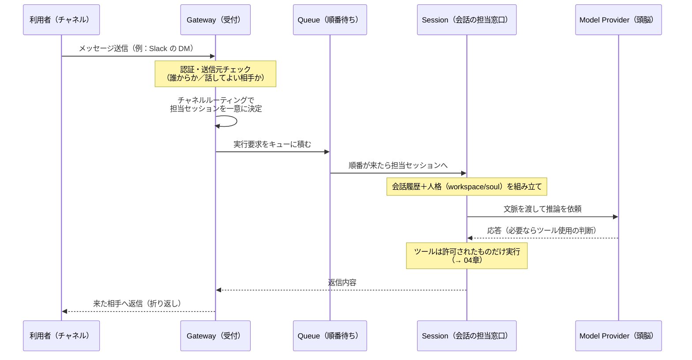

# 03. メッセージが届いてから返信まで

> 前へ ← [[lecture-architecture-02-gateway-hub-spoke]] ｜ 次へ → [[lecture-architecture-04-why-not-dangerous]]

「AI が**勝手に**動いて、**好きなところに**メッセージを送るのでは？」——この不安を、実際の処理の流れを追って解きます。結論を先に言うと、**AI は宛先を自由に選べません。決まった配線（ルーティング）の上を流れるだけ**です。

## たとえ：受付 → 担当者 → 折り返し電話

オフィスの受付（[[components/gateway]]）に電話がかかってくる場面を思い出してください。

1. 受付が電話を受ける（メッセージ受信）。
2. 受付は「この用件はこの担当（セッション）」と**決まったルール**で取り次ぐ。受付や担当者が気分で別の部署に回したりはしない。
3. 担当者（AI＝頭脳）が考えて答えをまとめる。
4. **かかってきた相手に折り返す**。勝手に無関係な番号にはかけない。

この「決まったルールで取り次ぎ、来た相手に返す」が、OpenClaw の**決定的（deterministic, 入力が決まれば行き先が一意に決まる）ルーティング**です。

## 受信から返信までの流れ

この一連のサイクルが **エージェントループ（agent loop, メッセージ受信→文脈構築→推論→ツール実行→応答という実行サイクル）**です（[[concepts/agent-loop]]）。

## 流れの中の登場人物

| 要素 | 役割 | たとえ |
|---|---|---|
| **[[concepts/messages]]** | 受信メッセージの正規化・取り扱い | 受け取った伝言 |
| **[[concepts/channel-routing]]** | どのセッションが担当かを**一意に**決める配線 | 受付の取り次ぎルール |
| **[[concepts/queue]]** | 実行要求を順番に・並行制御して捌く | 順番待ちの列 |
| **[[concepts/session]]** | 1 つの会話文脈（履歴・状態）を保持する担当窓口 | 案件ごとの担当者 |
| **[[concepts/agent]]** | 人格・振る舞いの定義（workspace / soul） | 担当者の人柄・マニュアル |
| **[[concepts/agent-runtimes]]** | 実際に推論を回す頭脳（モデル実行基盤） | 相談する専門家 |

ポイントは、**人格（どう振る舞うか）と頭脳（どう考えるか）が分かれている**こと。人格は workspace / soul（[[concepts/agent]]）で定義され、頭脳は runtimes（[[concepts/agent-runtimes]]）が担います。だから「どのモデルを使うか」を差し替えても、アシスタントの人格・ルールは保たれます。

## ここが効く：AI は宛先を選べない

不安の核心「AI が勝手に色々なところへ送る」に対する答えはこうです。

- **宛先はルーティングが決める**。AI（頭脳）は「Slack の田中さんに送ろう」と配線を選べるわけではなく、**来たチャネル・セッションに返す**のが基本（[[concepts/channel-routing]]）。
- **実行はキューで秩序立つ**。同時に殺到しても [[concepts/queue]] が順番と並行を制御するので、無秩序な暴発にはならない。
- **ツールは別途ゲートがある**。AI が「コマンドを実行したい」と判断しても、それが通るかは次章の**許可の関門**次第。判断と実行は別物です。

つまり「AI の賢さ」と「どこへ・何ができるか」は分離されています。**賢さがアクセス権を増やすわけではない**——これが次章の主題です。

## この章のまとめ

- 受信→ルーティング→キュー→セッション→推論→返信、という **エージェントループ**を回るだけ。
- ルーティングは**決定的**で、**AI は宛先を自由に選べない**。来た相手に返す。
- **人格（agent）と頭脳（runtimes）は分離**。モデルを替えても振る舞いは保たれる。
- 「考える」と「実際に何かする（ツール実行）」は別の関門——詳細は 04 章。

## 出典

- [[concepts/agent-loop]] / [[concepts/messages]] / [[concepts/session]] / [[concepts/queue]]
- [[concepts/agent]] / [[concepts/agent-runtimes]] / [[concepts/channel-routing]]
- [[sources/concepts/architecture]] — 接続〜実行のライフサイクル

> 次へ → [[lecture-architecture-04-why-not-dangerous]]
