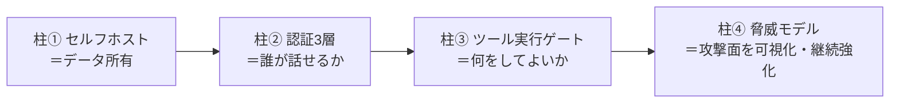

# 04. なぜ『危険』ではないのか

> 前へ ← [[lecture-architecture-03-message-flow]] ｜ 次へ → [[lecture-architecture-05-faq]]

ここが講義の本命です。01〜03 で「**形（アーキテクチャ）**」が分かりました。その形から、**危険が構造的に抑えられている**ことを 4 本の柱で説明します。

最初に核心を 1 文で：

> **OpenClaw の安全思想は「知能より前にアクセス制御」**。
> モデルの賢さや人格に安全を頼らず、**「誰が話せるか」「何をしてよいか」を構造（認証・隔離・承認）で先に縛る**（[[concepts/security]]）。

「AI が賢い／賢くない」は安全の根拠にしません。**賢くても、できることは構造が決める**——だから「賢い AI ＝危険」という連想自体が成り立たないのです。

## 安全を支える 4 本の柱

### 柱①：セルフホスト＝データ所有

OpenClaw は**あなたのインフラ**で動きます（[[concepts/architecture]]）。会話も認証情報も、知らない SaaS のサーバーに溜まりません。さらに前提として、**「1 Gateway = 1 信頼境界（1 人の信頼済みオペレーター）」**という設計（[[concepts/security]]）。つまり 1 つのゲートウェイは「あなた専用の執事」であって、見知らぬ他人と共有する公共端末ではない、という割り切りです。混在・敵対ユーザーが要るなら**ゲートウェイ自体を分ける**のが正しい使い方。

### 柱②：認証3層＝「誰が話せるか」

「誰でも AI に話しかけられたら危険」——その関門が**認証**です。OpenClaw の認証は紛らわしいので、**3 つの別物**として区別します（[[concepts/authentication]]）。

**表1：認証の 3 レイヤー（別々の関門）**

| レイヤー | 何を守るか | 仕組みの例 |
|---|---|---|
| **① Gateway 接続認証** | 誰がゲートウェイにつなげるか | `gateway.auth.mode`＝`none`/`token`/`password`/`trusted-proxy`。公開運用で `none` は使わない |
| **② モデル認証** | エージェントがどう外部モデルを呼ぶか | API キー / OAuth / `auth-profiles.json` |
| **③ デバイスペアリング** | どの端末を信頼するか | `connect` ＋ デバイストークン（[[concepts/pairing]]） |

> **ペアリング（pairing）**とは、新しい端末を「信頼済み」として承認し、デバイストークンを発行する手続き。執事に「この人は家族です」と登録するイメージです。登録していない端末は手足（[[components/node]]）として勝手にぶら下がれません。

ポイントは、これらが**別々の境界**だということ。「接続できる」ことと「モデルを呼べる」ことと「端末として信頼される」ことは別個に管理され、1 つ突破しても他は自動では開きません。

### 柱③：ツール実行ゲート＝「何をしてよいか」

「AI がコマンドを実行して本番を壊す」——最も恐れられる点です。ここは**多重のゲート**で守られます。まず、混同しやすい**3 つの制御**を分けて理解します（[[concepts/sandboxing]]）。

**表2：ツール実行の 3 制御（別々のダイヤル）**

| 制御 | 何を決めるか | たとえ |
|---|---|---|
| **サンドボックス** (`agents.*.sandbox`) | ツールを**どこで**実行するか（隔離環境 / ホスト） | 作業を「隔離した作業部屋」でやらせる |
| **ツールポリシー** (`tools.*`) | **どのツール**を許すか（`deny` 優先・ハードストップ） | そもそも使える道具を限定する |
| **昇格** (`tools.elevated`) | サンドボックス**外**で実行する脱出口 | 部屋の外に出る時の特別許可 |

> **サンドボックス（sandboxing）**とは、ツール実行を分離環境（既定は Docker コンテナ）に閉じ込め、誤動作してもホストのファイルやプロセスに届きにくくする仕組み。`docker.sock`・`/etc`・`~/.ssh` など危険なものへのアクセスは構造的にブロックされます。

さらに、最もリスクの高い**シェル実行（[[concepts/exec]]）**には承認の重ね合わせがかかります。

- **ツールポリシー**（そもそも `exec` が見えるか）→ **昇格ゲート**（隔離の外に出るか）→ **Exec 承認**（ポリシー＋許可リスト＋ユーザー承認）→ 実行ホスト。
- 設定で**ユーザーに毎回確認を求める**こともできます（`exec.ask`）。全部スキップして即実行する設定（俗に **YOLO モード** ＝ `full`＋ask off）は、危険を理解したうえで自分の責任で選ぶ**例外**であって既定ではありません。
- ⚠️ 注意として、`exec` は「読み取り専用」にはなりません（`write`/`edit` を切ってもシェル経由で変更可能）。だからこそ承認設計が肝心、というのが公式の立場です。

> 補足（継続的な強化）：承認の「毎回聞くと面倒、でも全自動は怖い」の中間として、**レビュアー AI が先に審査する `tools.exec.mode: "auto"`** が後から追加されています（二次資料：[[articles/safer-than-yolo-auto-mode-for-exec-approvals]]）。安全と利便のバランスを継続的に詰めている、ということです。

### 柱④：脅威モデル＝攻撃面の可視化と継続強化

「想定外の攻撃が怖い」に対しては、**攻撃される側の地図**を公開して潰し込む取り組みがあります（[[concepts/threat-model]]）。

- 攻撃を **MITRE ATLAS（AI システム向けの敵対的脅威フレームワーク）**で体系化し、**5 つの信頼境界**（チャネルアクセス／セッション分離／ツール実行／外部コンテンツ／サプライチェーン）に整理。
- 一部の安全条件は **TLA+/TLC で機械検証**（形式検証）し、回帰バグを再現できるようにしている。
- 既知の最大級リスク（プロンプトインジェクション、悪意ある Skill 公開など）も**隠さず明示**し、対策を進めている。たとえば外部スキルの公開前検証ゲート（二次資料：[[articles/openclaw-nvidia-skill-security]]）。

> **プロンプトインジェクション**とは、受信メッセージや外部コンテンツに紛れた指示で AI を誤誘導する攻撃。OpenClaw は「賢さで防ぐ」のではなく、高リスク経路（オープングループ＋昇格 exec など）を**設計で塞ぐ**方針です。秘密値は [[concepts/secrets]] の仕組みで平文を避けて外部化します。

## まとめ：なぜ「わからないが危険」が崩れるか

| 漠然とした不安 | 構造による答え |
|---|---|
| AI が賢いから何でもできそう | 「知能より前にアクセス制御」。できることは構造が決める |
| 誰でも話しかけられそう | 認証3層（接続／モデル／端末）で関門 |
| コマンドで壊しそう | サンドボックス＋ツールポリシー＋exec 承認の多重ゲート |
| データが漏れそう | セルフホスト＝データ所有、1 Gateway=1 信頼境界 |
| 未知の攻撃が怖い | 脅威モデルで攻撃面を可視化・形式検証・継続強化 |

危険は「気をつける」ではなく**構造**で抑えられている——だから「よくわからないが危険」は、「**仕組みが分かれば、危険は管理されている**」に置き換わります。

## 出典

- [[concepts/security]]（知能より前にアクセス制御 / 1 Gateway=1 信頼境界）
- [[concepts/authentication]] / [[concepts/pairing]] — 認証3層・端末信頼
- [[concepts/sandboxing]] / [[concepts/exec]] — ツール実行の隔離と承認
- [[concepts/threat-model]] / [[concepts/secrets]] / [[concepts/architecture]]
- 二次資料：[[articles/safer-than-yolo-auto-mode-for-exec-approvals]] / [[articles/openclaw-nvidia-skill-security]]

> 次へ → [[lecture-architecture-05-faq]]
