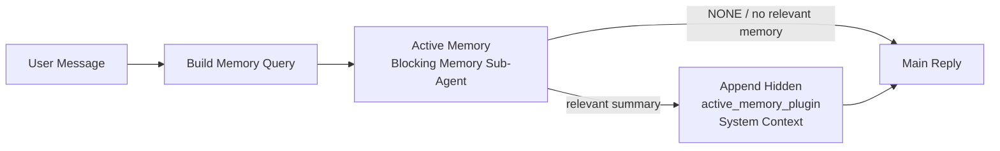

# Active Memory（解説）

> 原典: `raw/docs/concepts/active-memory.md` ・ https://docs.openclaw.ai/ja-JP/concepts/active-memory

## 一言まとめ

Active Memory は、対象セッションで**メイン応答の前に走る Plugin 所有のブロッキングなメモリサブエージェント**。多くのメモリは「エージェントが検索を決める／ユーザーが頼む」リアクティブなものだが、Active Memory はメイン応答が生成される前に**先回りで関連メモリを表面化する**境界付きの 1 機会をシステムに与える。

## 位置づけ

[[concepts/memory]] の検索（[[concepts/memory-search]]）を「応答前のプロアクティブな想起」として使う Plugin。注入は隠れたプロンプト接頭辞として行われ、[[concepts/system-prompt]] の Active Memory セクションに供給される。返信経路で走るためレイテンシが直結する点が設計上の肝。

## 仕組み・ふるまい

- ブロッキングメモリサブエージェントは**設定されたメモリ想起ツールのみ**を使える（既定 `memory_search`/`memory_get`、`memory-lancedb` スロットなら `memory_recall`）。関連性が弱ければ `NONE` を返す。
- 注入は「信頼できないコンテキスト（メタデータ。指示として扱うな）」として `<active_memory_plugin>...</active_memory_plugin>` で囲まれ、クライアント可視応答には生タグを出さない。`/verbose on` でステータス行、`/trace on` でデバッグ要約を確認できる。

### 実行ゲート

`プラグイン有効 ＋ エージェント ID が対象 ＋ 許可チャットタイプ ＋ 対象が対話的な永続チャットセッション = 実行`。ヘッドレスのワンショット・Heartbeat・サブエージェント・内部 agent-command では走らない。

### クエリモードとプロンプトスタイル

- `queryMode`：`message`（最新メッセージのみ・最速）/`recent`（直近の末尾も。既定）/`full`（全会話・最も高品質だが遅い）。タイムアウト予算はモードに応じて増やす。
- `promptStyle`：`balanced`/`strict`/`contextual`/`recall-heavy`/`precision-heavy`/`preference-only`。未設定時は `message→strict`、`recent→balanced`、`full→contextual`。

## 設定・使い方の要点

- 設定は `plugins.entries.active-memory.config`。安全な既定は `agents: ["main"]`・`allowedChatTypes: ["direct"]`・`modelFallback: "google/gemini-3-flash"`・`queryMode: "recent"`・`timeoutMs: 15000`。
- **モデル**：`config.model` 未設定なら現在のセッションモデルを継承（最も安全）。高速化したいなら専用の低レイテンシモデル（例 `cerebras/gpt-oss-120b`）。解決順は 明示→セッション→エージェント主→`modelFallback`。
- セッション単位の一時停止は `/active-memory off`（`--global` でグローバル設定書き込み）。
- スコープ絞り込み：`allowedChatTypes` ＋ `allowedChatIds`（空でなければフェイルクローズ）＋ `deniedChatIds`（常に優先）。

## 注意点・落とし穴

- **レイテンシが直結する**：`config.thinking` を既定でオンにしない（返信経路で見えるレイテンシが増える）。`queryMode` を上げるほど遅くなる。
- **コールドスタート**：v2026.5.2 以降、再起動後の最初の想起は `setupGraceTimeoutMs`（既定 0）を設定しないと `status=timeout` で空を返しやすい。旧 `timeoutMs: 15000` 運用なら `setupGraceTimeoutMs: 30000` を足す。
- 想起の不調はたいてい埋め込みプロバイダー側の問題（Active Memory のバグではない）。プロバイダーを明示固定する（→ [[concepts/memory-search]]）。
- 別メモリ Plugin を使うときは `config.toolsAllow` にそのツール名を設定（ワイルドカードやコアツールは無視される）。

## 用語と略称

- **ブロッキングメモリサブエージェント** = メイン応答前に同期実行される想起専用の子エージェント
- **想起（recall）** = 関連する過去メモリを引き出すこと
- **プロアクティブ vs リアクティブ** = 先回り想起 / 求められてからの想起
- **サーキットブレーカー** = 連続タイムアウト時に想起をスキップする保護（`circuitBreakerMaxTimeouts`）

## 関連ページ

- [[concepts/active-memory]] — 対応する概念ページ
- [[concepts/memory]] / [[concepts/memory-search]] / [[concepts/system-prompt]]
- [[concepts/context-engine]]（Lossless Claw 等のリコールツール連携）
