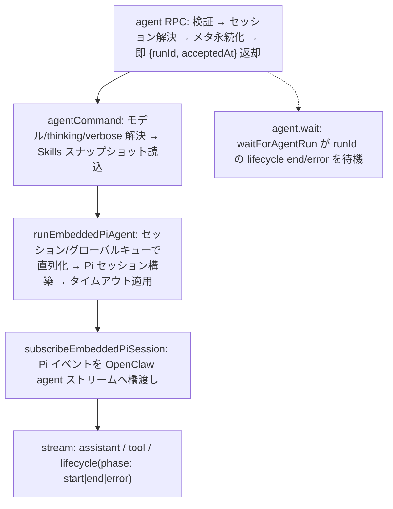

# エージェントループ（解説）

> 原典: `raw/docs/concepts/agent-loop.md` ・ https://docs.openclaw.ai/ja-JP/concepts/agent-loop

## 一言まとめ

**エージェントループ**は、メッセージを実際のアクションと最終返信に変換する「権威ある実行パス」――受付 → コンテキスト組立 → モデル推論 → ツール実行 → ストリーミング返信 → 永続化。セッションごとに 1 本の直列化された実行として走り、その間ライフサイクルイベントとストリームイベントを発行する、という配線をエンドツーエンドで説明したページ。

## 位置づけ

[[components/gateway]] の `agent` RPC（または [[components/cli]] の `agent` コマンド）から始まり、[[concepts/agent]] が定めるワークスペース・セッション契約の上で走る。実行を担うバックエンドの選択は [[concepts/agent-runtimes]]。つまり本ページは「箱の中身が 1 回動く様子」を、最も具体的なイベントレベルで描く。

## 仕組み・ふるまい

### 全体の流れ

- **エントリポイント**：Gateway RPC の `agent` と `agent.wait`、CLI の `agent` コマンド。
- `agent` RPC はパラメーター検証 → セッション解決 → メタ永続化のあと、すぐ `{runId, acceptedAt}` を返す（実行は非同期）。
- `runEmbeddedPiAgent` は **セッションキーごと（＋任意でグローバル）に実行を直列化**し、Pi セッションを構築、Pi イベントを購読してアシスタント/ツールのデルタをストリーム、タイムアウトで中止する。
- `agent.wait` は `waitForAgentRun` で対象 `runId` の lifecycle end/error を待ち、`{status: ok|error|timeout, ...}` を返す（待つだけで、エージェント自体は止めない）。

### キューイング＋並行実行

- 実行は **セッションレーン**（セッションキーごと）で直列化され、ツール/セッションの競合を防ぎ履歴の一貫性を保つ。メッセージングチャネルはこのレーンに供給するキューモード（collect/steer/followup）を選べる（→ [[concepts/queue]]）。
- トランスクリプト書き込みは**セッション書き込みロック**（ファイルベース・プロセス認識）で保護。`session.writeLock.acquireTimeoutMs`（既定 60000ms）まで待ってからビジー報告。既定で再入不可（意図的にネストするときだけ `allowReentrant: true`）。

### フックポイント（介入できる場所）

2 系統ある。**内部フック（Gateway フック）**＝コマンド/ライフサイクル用のイベント駆動スクリプト（例 `agent:bootstrap`、`/new` `/reset` `/stop` などのコマンドフック）。**Plugin フック**＝エージェント/ツールのライフサイクル拡張点。代表例：

- `before_model_resolve`（モデル解決前に provider/model を上書き）、`before_prompt_build`（プロンプト送信前にコンテキスト注入）、`before_agent_reply`（LLM 呼び出し前にターンを引き受け／サイレント化）、`agent_end`（完了後の検査）、`before_compaction`/`after_compaction`、`before_tool_call`/`after_tool_call`、`tool_result_persist`、`message_received`/`message_sending`/`message_sent`、`session_start`/`session_end`、`gateway_start`/`gateway_stop`。
- ガード系の判定：`before_tool_call` の `{block:true}` は終端、`{block:false}` は no-op（前のブロックは解除しない）。`message_sending` の `{cancel:true}` も同様に終端。

### ストリーミング・返信整形・Compaction

- アシスタントデルタは pi-agent-core からストリーミングされ `assistant` イベントで発行。ブロックストリーミングは `text_end`/`message_end` で部分返信。
- 最終ペイロードはアシスタントテキスト（＋任意の推論）＋インラインツール要約から組み立て。`NO_REPLY`/`no_reply` のサイレントトークンや重複メッセージング送信はフィルタ。
- 自動 **Compaction**（長い会話の要約圧縮）は `compaction` イベントを発行しリトライをトリガーでき、リトライ時は重複出力回避のためバッファとツール要約をリセット（→ [[concepts/compaction]]）。

## 設定・使い方の要点（タイムアウト）

- `agent.wait` 既定 30s（待機のみ、`timeoutMs` で上書き）。
- エージェントランタイム：`agents.defaults.timeoutSeconds` 既定 **172800s（48 時間）**、`runEmbeddedPiAgent` の中止タイマーで適用。
- Cron ランタイムのタイムアウトは cron が所有。
- モデルアイドルタイムアウト：アイドル窓内にチャンクが来なければ中止。遅いローカル/セルフホストの provider は `models.providers.<id>.timeoutSeconds` でアイドルウォッチドッグを延長（明示が無ければ既定 120s 上限）。
- 早期終了し得る場所：エージェントタイムアウト（中止）、AbortSignal（キャンセル）、Gateway 切断/RPC タイムアウト、`agent.wait` タイムアウト（待機のみ）。

## 注意点・落とし穴

- `agent` は **即 ack を返す非同期実行**。完了を知るには `agent.wait` かイベント購読が要る。
- セッションは直列化されるため、同一セッションへの同時実行は詰まる。長時間 `processing` のまま進捗が無いセッションは診断（`diagnostics.stuckSessionWarnMs` など）で `long_running`/`stalled`/`stuck` に分類され、停止実行は `stuckSessionAbortMs`（既定: 最低 10 分かつ警告閾値の 5 倍）後にのみ abort-drain される。

## 用語と略称

- **RPC** = Remote Procedure Call（遠隔手続き呼び出し）
- **runId** = 1 回のエージェント実行を識別する ID
- **セッションレーン** = セッション単位の直列実行キュー（競合防止）
- **Compaction** = 長い会話履歴を要約して圧縮する処理
- **フック（hook）** = ライフサイクルの特定点で差し込む拡張スクリプト
- **abort-drain** = 停止した実行を中止してレーンを解放する処理

## 関連ページ

- [[concepts/agent-loop]] — 本ドキュメントに対応する概念ページ
- [[concepts/agent]] — ワークスペース/セッション契約
- [[concepts/agent-runtimes]] — 実行バックエンドの層
- [[concepts/system-prompt]] / [[concepts/compaction]] / [[concepts/queue]] / [[concepts/streaming]]
