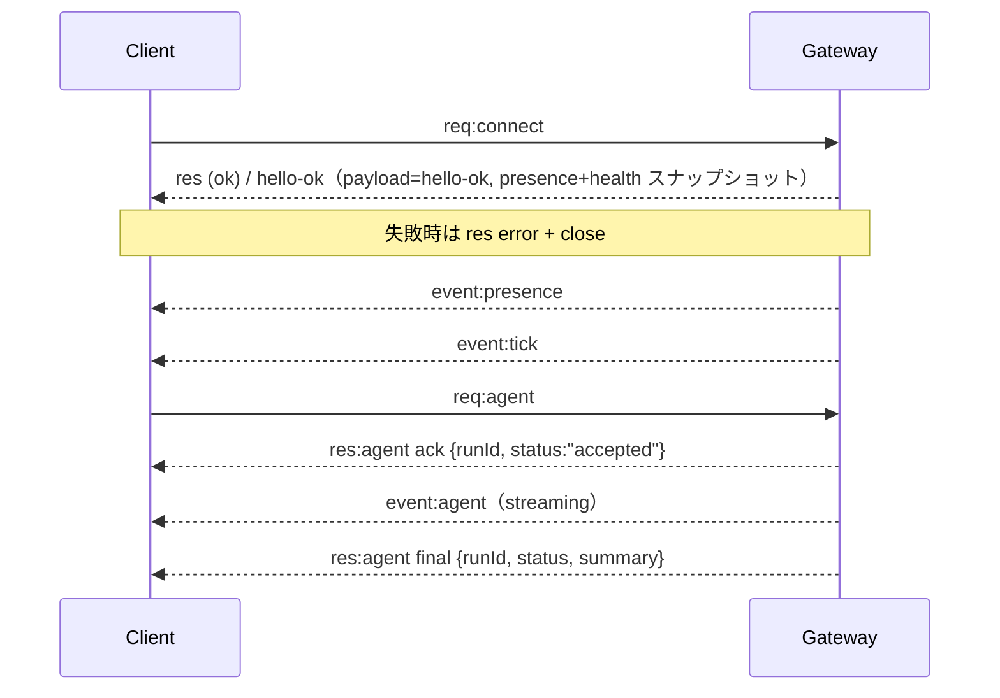

# Gateway アーキテクチャ（解説）

> 原典: `raw/docs/concepts/architecture.md` ・ https://docs.openclaw.ai/ja-JP/concepts/architecture

## 一言まとめ

OpenClaw は **ホストごとにただ 1 つの常駐プロセス「Gateway（ゲートウェイ）」** を中心に据え、すべてのメッセージング接続を Gateway が所有し、各種クライアントと端末は **WS（WebSocket, 単一コネクション上で双方向にメッセージをやり取りするトランスポート）** で Gateway につながる、というハブ＆スポーク型の構成を説明したページ。

## 位置づけ

このページは OpenClaw の全体骨格＝[[components/gateway]] を中心とした接続トポロジーを定義する。エージェントが実際に走る仕組みは [[concepts/agent-loop]]、その 1 プロセス分の契約は [[concepts/agent]]、端末側は [[components/node]] に対応する。つまり本ページは「箱と線」を、agent 系ページは「箱の中身」を扱う関係にある。

## 仕組み・ふるまい

### 構成要素

- **Gateway（デーモン）**：プロバイダー接続（Baileys 経由の WhatsApp、grammY 経由の Telegram、Slack、Discord、Signal、iMessage、WebChat）を維持する。型付きの WS API（リクエスト／レスポンス／サーバープッシュイベント）を公開し、受信フレームを JSON Schema で検証し、`agent` `chat` `presence` `health` `heartbeat` `cron` などのイベントを発行する。**ホストごとに Gateway は 1 つ**で、WhatsApp セッションを開く唯一の場所でもある。
- **クライアント**（macOS アプリ / [[components/cli]] / Web 管理 UI）：1 クライアント = 1 WS 接続。`health` `status` `send` `agent` `system-presence` などのリクエストを送り、`tick` `agent` `presence` `shutdown` などのイベントを購読する。
- **[[components/node]]（Node）**：同じ WS サーバーに `role: node` を宣言して接続する端末（macOS/iOS/Android/ヘッドレス）。`connect` でデバイス ID を提供し、`canvas.*` `camera.*` `screen.record` `location.get` などのコマンドを公開する。
- **WebChat**：Gateway の WS API でチャット履歴・送信を行う静的 UI。リモートでは他クライアントと同じ SSH/Tailscale トンネルを通る。
- **canvas host**：Gateway の HTTP サーバーが `/__openclaw__/canvas/`（エージェントが編集できる HTML/CSS/JS）と `/__openclaw__/a2ui/`（A2UI = Agent-to-UI ホスト）を Gateway と同じポート（デフォルト `18789`）で提供する。

### 接続ライフサイクル（単一クライアント）

原典のシーケンス図を Mermaid で描き直したもの（最初のフレームは必ず `connect`、以降はリクエスト／イベントが流れる）：

### ワイヤープロトコル（概要）

- トランスポートは WebSocket、テキストフレームに JSON ペイロード。**最初のフレームは必ず `connect`**。
- ハンドシェイク後：リクエスト `{type:"req", id, method, params}` → レスポンス `{type:"res", id, ok, payload|error}`、サーバー発のイベント `{type:"event", event, payload, seq?, stateVersion?}`。
- 認証は Gateway の認証モードに依存：共有シークレットは `connect.params.auth.token`／`password`、Tailscale Serve や `trusted-proxy` などの ID を持つモードはリクエストヘッダーから認証を満たす。`mode: "none"` は共有シークレット認証を無効化する（公開・非信頼の入口では使わない）。
- 副作用のあるメソッド（`send` `agent`）の安全な再試行には**冪等性キー**が必要（サーバーは短命の重複排除キャッシュを持つ）。

## 設定・使い方の要点

- 起動：`openclaw gateway`（フォアグラウンド、ログは stdout）。自動再起動には launchd/systemd で監督する。
- バインドは既定で `127.0.0.1:18789`。
- リモートアクセスは **Tailscale または VPN を推奨**、代替は SSH トンネル（`ssh -N -L 18789:127.0.0.1:18789 user@host`）。同じハンドシェイク＋認証トークンがトンネル越しにも適用され、WS に TLS＋任意のピン留めを足せる。
- プロトコルの型は **TypeBox スキーマ**が定義し、そこから JSON Schema を生成、さらに Swift モデルを生成する。

## 注意点・落とし穴

- **不変条件**：Gateway はホストごとに 1 つ・単一の Baileys（WhatsApp）セッションを制御する。ハンドシェイクは必須で、非 JSON または `connect` でない最初のフレームは即時クローズ。**イベントは再生されない**ため、取りこぼしたクライアントは状態を取り直す必要がある。
- ペアリング（[[concepts/pairing]]）：すべての WS クライアント（オペレーター＋Node）は `connect` にデバイス ID を含める。新しいデバイス ID はペアリング承認が必要で、Gateway はデバイストークンを発行する。同一ホストの local loopback は自動承認できるが、**Tailnet/LAN（同一ホストの tailnet バインド含む）と非ローカル接続は明示的な承認が必要**。すべての接続は `connect.challenge` の nonce に署名する。
- Gateway 認証（`gateway.auth.*`）は**ローカル・リモートを問わず全接続に適用**される。

## 用語と略称

- **WS** = WebSocket（双方向通信トランスポート）
- **A2UI** = Agent-to-UI（エージェントが描画する UI のホスト）
- **Baileys** = WhatsApp に接続するためのライブラリ／**grammY** = Telegram 用ライブラリ
- **nonce** = 使い捨ての乱数（リプレイ攻撃防止に署名対象とする値）
- **TypeBox** = TypeScript で型と JSON Schema を同時に定義するライブラリ

## 関連ページ

- [[concepts/architecture]] — 本ドキュメントに対応する概念ページ（俯瞰）
- [[components/gateway]] / [[components/node]]
- [[concepts/agent-loop]] — Gateway の `agent` RPC から始まる実行サイクル
- [[concepts/pairing]] — デバイス承認とトークン
