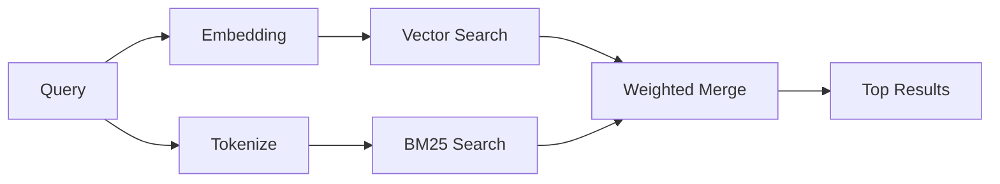

# メモリ検索（解説）

> 原典: `raw/docs/concepts/memory-search.md` ・ https://docs.openclaw.ai/ja-JP/concepts/memory-search

## 一言まとめ

`memory_search` は、表現が元テキストと違っても関連ノートを見つけるツール。メモリを小さなチャンクに索引化し、**埋め込み（ベクトル）とキーワード（BM25）の 2 経路を並列に実行してマージする**ハイブリッド検索の仕組みとプロバイダー設定・調整を説明したページ。

## 位置づけ

[[concepts/memory]] の検索エンジン部分で、[[concepts/active-memory]] の先回り想起もこのパイプラインに乗る。バックエンド（[[sources/concepts/memory-builtin]]/[[sources/concepts/memory-qmd]]）によって実装は変わるが、ハイブリッド検索という考え方は共通。

## 仕組み・ふるまい

- **ベクトル検索**：意味が近いノートを見つける（「gateway host」が「the machine running OpenClaw」に一致）。
- **BM25 キーワード検索**：完全一致（ID・エラー文字列・設定キー）を見つける。
- 片方の経路しか使えない場合（埋め込み無し or FTS 無し）はもう片方だけ実行。埋め込みが無くても素の完全一致順ではなく**字句ランキング**（クエリ語カバレッジ＋関連パスのブースト）にフォールバックする。

### 対応プロバイダー（埋め込み）

Bedrock（キー不要・AWS チェーン）/Gemini（画像・音声索引可）/GitHub Copilot（サブスク）/Local（GGUF、約 0.6GB）/Mistral/Ollama（明示設定）/OpenAI（既定・高速）/Voyage。OpenAI・Gemini・Voyage・Mistral のキーがあれば**自動検出**で有効になる。

## 設定・使い方の要点

- 明示設定：`agents.defaults.memorySearch.provider: "openai"`（`gemini`/`local`/`ollama` 等）。API キー不要のローカル埋め込みは `provider: "local"`（ソースチェックアウトでは `pnpm approve-builds` → `pnpm rebuild node-llama-cpp`）。
- 非対称ラベルが要るエンドポイントは `memorySearch.queryInputType`/`documentInputType`（`"query"`/`"document"`）。
- **検索品質の改善**（任意）：`temporalDecay`（時間減衰。既定半減期 30 日、`MEMORY.md` 等の常緑は減衰しない）と `mmr`（多様性。ほぼ重複の結果を減らす）。`memorySearch.query.hybrid` 配下で両方有効化できる。
- **マルチモーダル**：Gemini Embedding 2 で画像・音声も索引化（クエリはテキストのまま照合）。
- **セッションメモリ検索**（実験的）：`memorySearch.experimental.sessionMemory` でトランスクリプトを索引化し過去会話を想起。

## 注意点・落とし穴

- 結果なし→`openclaw memory status`、空なら `openclaw memory index --force`。
- キーワード一致のみ→埋め込みプロバイダー未設定の可能性（`openclaw memory status --deep`）。
- プロバイダーが実行間で変わると挙動がぶれる（自動検出は最初に解決できたキーを使う）。**決定的にするにはプロバイダーを明示固定**。実行後のランタイム失敗は自動フォールバックしない。
- CJK が見つからない→`openclaw memory index --force` で FTS 再構築。

## 用語と略称

- **BM25** = キーワード検索のランキング関数（全文検索 FTS で使う）
- **FTS** = Full-Text Search（全文検索インデックス）
- **埋め込み（embedding）** = テキストを意味ベクトル化する処理
- **MMR** = Maximal Marginal Relevance（結果の多様性を高める手法）
- **GGUF** = ローカルモデルのファイル形式

## 関連ページ

- [[concepts/memory-search]] — 対応する概念ページ
- [[concepts/memory]] / [[concepts/active-memory]]
- [[sources/concepts/memory-builtin]] / [[sources/concepts/memory-qmd]]
