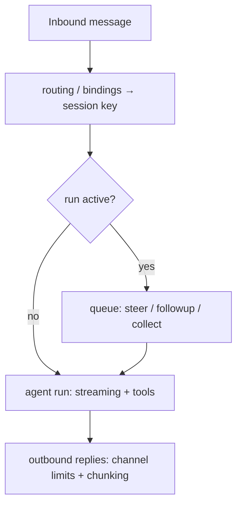

# メッセージ（解説）

> 原典: `raw/docs/concepts/messages.md` ・ https://docs.openclaw.ai/ja-JP/concepts/messages

## 一言まとめ

受信メッセージから返信までの**処理パイプライン**――セッション解決 → キューイング → ストリーミング → ツール実行 → 推論可視性 → 送信――の全体像と、各段の設定の置き場所を示すハブページ。

## 位置づけ

[[concepts/multi-agent]] のルーティング、[[concepts/queue]] のキューイング、[[concepts/streaming]] のストリーミング、[[concepts/session]] のセッションを 1 本の流れに束ねる「メッセージ処理の地図」。各論は個別ページ、本ページは配線。

## 仕組み・ふるまい

- 設定の主要ノブ：プレフィックス/キュー/グループ動作は `messages.*`、ブロックストリーミング/チャンク化は `agents.defaults.*`、上限/ストリーミング切替はチャネル（`channels.<ch>.*`）。
- **受信の重複排除**：チャネル/アカウント/ピア/セッション/メッセージ ID をキーにした短命キャッシュで、再接続時の再配信が別実行を起こさないようにする。
- **受信のデバウンス**：同じ送信者の連続短文を `messages.inbound`（既定 2000ms、チャネル別上書き）で 1 ターンに結合。テキストのみ対象（メディアは即フラッシュ）、制御コマンドはデバウンスを迂回。
- **受信本文の分離**：`BodyForAgent`（モデル向け主テキスト）/`Body`（レガシーフォールバック）/`CommandBody`（ディレクティブ解析用の生テキスト、別名 `RawBody`）。非ダイレクトチャットでは現在メッセージ先頭に送信者ラベルが付き、履歴は信頼されないコンテキストブロックとしてレンダリングされる（`messages.groupChat.historyLimit` 等で制御）。
- **ツール結果メタデータ**：`content`（モデルが見る結果）と `details`（UI/診断/メディア用ランタイムメタ）を明確に分離。`details` はプロバイダーリプレイと Compaction 入力の前に取り除かれ、永続化時は制限される。

## 設定・使い方の要点

- **キューイング**は [[concepts/queue]]（`messages.queue`、既定 `steer`）。**ストリーミング/チャンク化**は [[concepts/streaming]]（`blockStreaming*`、`humanDelay`）。
- **推論の可視性**：`/reasoning on|off|stream`。推論コンテンツはトークン使用量にカウントされる（tools/thinking）。
- **プレフィックス/返信スレッド**：`messages.responsePrefix`（カスケード）、`replyToMode`。
- **セッションは Gateway 所有**：ダイレクトはメインセッションキーに統合、グループ/チャネルは独自キー。長い会話は 1 主要デバイス推奨（Control UI/TUI が信頼できる情報源）。

## 注意点・落とし穴

- **サイレント返信**：`NO_REPLY`/`no_reply` は「可視返信を配信しない」。ダイレクトは既定でサイレンス不可（短い可視フォールバックに書き換え）、グループ/内部オーケストレーションは既定で許可。非ダイレクトの内部ランナー障害もサイレント化され、グループに Gateway エラー定型文が出ない（生の詳細は `/verbose on|full` のみ）。保留中のツールメディア（TTS 等）はサイレントでも配信される。
- チャネル Plugin はセッションキュー前に順序保持/デバウンス/バックプレッシャーを担うが、エージェントターンに別タイムアウトを課すべきでない。

## 用語と略称

- **デバウンス（debounce）** = 連続入力をまとめる静穏ウィンドウ
- **重複排除（dedup）** = 同一メッセージの二重処理を防ぐこと
- **BodyForAgent / CommandBody** = モデル向け本文 / コマンド解析用の生本文
- **サイレント返信** = ユーザーに可視の返信を出さないこと（`NO_REPLY`）
- **TTS** = Text-to-Speech（音声合成）

## 関連ページ

- [[concepts/messages]] — 対応する概念ページ
- [[concepts/queue]] / [[concepts/streaming]] / [[concepts/retry]] / [[concepts/progress-drafts]]
- [[concepts/session]] / [[concepts/multi-agent]]
- [[sources/concepts/message-lifecycle-refactor]] — 送受信ライフサイクルの将来設計
