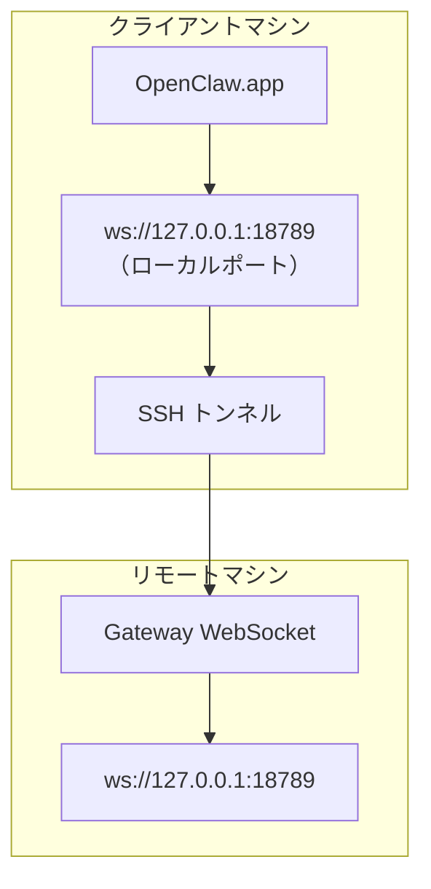

# リモート Gateway のセットアップ（解説）

> 原典: `raw/docs/gateway/remote-gateway-readme.md` ・ https://docs.openclaw.ai/ja-JP/gateway/remote-gateway-readme
>
> ℹ️ この内容は [[sources/gateway/remote]] に**統合済み**。現行ガイドはそちらを参照。本ページは OpenClaw.app（macOS）を SSH トンネルでリモート Gateway に繋ぐ手順の独立版。

## 一言まとめ

OpenClaw.app を SSH トンネル経由でリモート Gateway に接続する**ステップバイステップ**。クライアント側 `ws://127.0.0.1:18789` を SSH でリモートの 18789 に転送する、という [[concepts/remote-access]] の基本形を具体化したもの。

## 仕組み・ふるまい

## 設定・使い方の要点

1. `~/.ssh/config` に `Host remote-gateway` ＋ `LocalForward 18789 127.0.0.1:18789` ＋ `IdentityFile`。
2. `ssh-copy-id` で公開鍵をコピー。
3. `openclaw config set gateway.remote.token "<token>"`。
4. `ssh -N remote-gateway &` でトンネル開始。
5. OpenClaw.app を再起動。
- ログイン時自動起動は LaunchAgent `ai.openclaw.ssh-tunnel.plist`（`KeepAlive`/`RunAtLoad`）。診断は `ps aux | grep "ssh -N remote-gateway"`・`lsof -i :18789`。

## 注意点・落とし穴

- レガシー：残存する `com.openclaw.ssh-tunnel` LaunchAgent は削除。詳細・セキュリティルールは統合先 [[sources/gateway/remote]]。

## 用語と略称

- **LocalForward** = SSH のローカルポート転送ディレクティブ
- **LaunchAgent** = macOS のログイン時自動起動
- **`ssh -N`** = リモートコマンドを実行しない（転送専用）SSH

## 関連ページ

- [[concepts/remote-access]] / [[sources/gateway/remote]] / [[sources/gateway/tailscale]]
