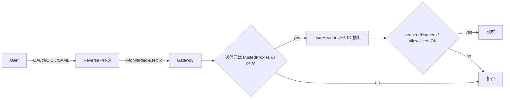

# 信頼済みプロキシ認証（解説）

> 原典: `raw/docs/gateway/trusted-proxy-auth.md` ・ https://docs.openclaw.ai/ja-JP/gateway/trusted-proxy-auth
>
> ⚠️ **セキュリティ上注意が必要なモード**。認証を完全にリバースプロキシへ委任するため、設定ミスは不正アクセスに直結する。

## 一言まとめ

`gateway.auth.mode = "trusted-proxy"` は、**ID 認識リバースプロキシ**（Pomerium / Caddy+OAuth / nginx+oauth2-proxy / Traefik）の背後で OpenClaw を動かし、**認証をプロキシに委任**して、プロキシが付けた ID ヘッダーから利用者を識別するモード。Gateway 接続認証の一形態。

## 位置づけ

[[concepts/authentication]] の「Gateway 接続認証」面（誰が Gateway につなげるか）。共有トークン/パスワードの代わりに、Kubernetes/コンテナや OAuth/OIDC/SAML の組織環境で使う。デバイスペアリング（[[concepts/pairing]]）はこのモードでは主ゲートでなくなる。

## 仕組み・ふるまい

- **ループバック送信元は既定で拒否**（`127.0.0.1`/`::1`）。同一ホストのループバックプロキシは `allowLoopback: true` を明示しないと満たさない。
- **転送ヘッダーの証拠が優先**：ループバック到着でも非ローカルを指す `X-Forwarded-*` があれば、ローカル直接パスワードフォールバック/デバイス ID ゲートの対象外。
- Control UI WS は trusted-proxy 通過時にデバイスペアリング ID なしで接続できる（アクセス制御はプロキシの認証ポリシー＋`allowUsers` が実効）。

## 設定・使い方の要点

- `gateway.bind: "lan"`、`gateway.trustedProxies: ["<proxy IP>"]`（**実際のプロキシ IP のみ**、サブネット全体にしない）、`gateway.auth: { mode: "trusted-proxy", trustedProxy: { userHeader, requiredHeaders?, allowUsers?, allowLoopback? } }`。
- **TLS/HSTS**：終端は 1 か所。プロキシ終端なら `Strict-Transport-Security` をプロキシで（推奨）、Gateway 終端なら `gateway.tls.enabled` ＋ `gateway.http.securityHeaders.strictTransportSecurity`。
- **オペレータースコープ**：ID 付き HTTP なので `x-openclaw-scopes`（`operator.read,write,admin`）で宣言可。Plugin HTTP ルートはヘッダー無しだと `operator.write` にフォールバック。
- 内部の非プロキシ呼び出し元は trusted-proxy ヘッダーでなく `gateway.auth.password` を使う。
- 移行時は `openclaw security audit`（trusted-proxy は **critical** 検出が付く＝意図的なリマインダー）。

## 注意点・落とし穴

- **混在トークン設定は拒否**（`gateway.auth.token` と `mode: "trusted-proxy"` の同時設定 → 起動時 `mixed_trusted_proxy_token`）。トークンフォールバックは意図的に非サポート。
- **セキュリティチェックリスト**：プロキシが唯一の経路（Gateway ポートはファイアウォールでプロキシ以外を遮断）／プロキシがクライアントの `x-forwarded-*` を**上書き**（追記でなく）／`allowUsers` を設定／非ループバック Control UI は `allowedOrigins` 明示。
- トラブル理由コード：`trusted_proxy_untrusted_source`/`_loopback_source`/`_user_missing`/`_missing_header_*`/`_user_not_allowed`/`_origin_not_allowed`。WS が失敗するならプロキシが WS アップグレード＋ID ヘッダーを通しているか確認。

## 用語と略称

- **trusted-proxy** = 認証をリバースプロキシに委任する Gateway 接続認証モード
- **ID 認識プロキシ** = OAuth/OIDC/SAML で利用者を認証し ID ヘッダーを付すプロキシ
- **OIDC / SAML** = 認証フェデレーションの規格
- **HSTS** = HTTP Strict Transport Security（HTTPS 強制ヘッダー）
- **forward auth** = プロキシが各リクエストを認証サービスに問い合わせる方式（Traefik 等）

## 関連ページ

- [[concepts/authentication]] — 認証の全体像（接続認証の一形態）
- [[components/gateway]] / [[concepts/configuration]]
- [[concepts/pairing]]— このモードでの扱いの変化
