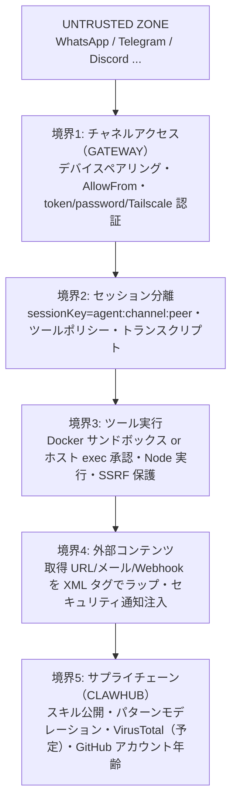

# 脅威モデル（MITRE ATLAS）（解説）

> 原典: `raw/docs/security/threat-model-atlas.md` ・ https://docs.openclaw.ai/ja-JP/security/THREAT-MODEL-ATLAS
>
> ℹ️ 大きな「生きたドキュメント」。本ページは全 T-XXX 表を転記せず、**5 つの信頼境界・主要な攻撃カテゴリ・リスク最上位**に圧縮する。

## 一言まとめ

OpenClaw と ClawHub（スキルマーケットプレイス）への敵対的脅威を **MITRE ATLAS**（Adversarial Threat Landscape for AI Systems, AI システム向けの敵対的脅威フレームワーク）で体系化したコミュニティ保守の脅威モデル。

## 位置づけ

[[concepts/threat-model]] の中核ソース。[[concepts/security]]（設計・強化の「守る側」）に対し、本ページは ATLAS 戦術に沿った「攻める側」の分析。緩和の多くは [[concepts/sandboxing]]・[[concepts/pairing]]・[[concepts/http-api]] のハード拒否などに対応する。

## 仕組み・ふるまい（5 つの信頼境界）

- **ATLAS 戦術別の脅威**（抜粋）：偵察（エンドポイント検出）、初期アクセス（ペアリングコード傍受=DM 1h/Node 5m 猶予、AllowFrom なりすまし、トークン窃取）、実行（**直接/間接プロンプトインジェクション**＝最重大、ツール引数インジェクション、exec 承認バイパス）、永続化（**悪意ある Skill 公開/更新汚染**＝サプライチェーン）、防御回避（モデレーション/ラッパー脱出）、発見（ツール列挙）、持ち出し（`web_fetch` 経由窃取、認証情報収集）、影響（不正コマンド実行、リソース枯渇/DoS）。
- **最上位リスク（P0）**：T-EXEC-001（直接プロンプトインジェクション）・T-PERSIST-001（悪意ある Skill）・T-EXFIL-003（認証情報収集）。代表的攻撃チェーン＝「悪意ある Skill 公開→モデレーション回避→認証情報収集」「プロンプトインジェクション→exec 承認バイパス→コマンド実行」。

## 設定・使い方の要点

- 現状の緩和：デフォルト loopback バインド・Tailscale 認証・外部コンテンツの XML ラップ＋セキュリティ通知・SSRF ブロック（[[sources/security/network-proxy]]）・exec 承認・送信者ごとセッション分離。
- 主要セキュリティファイル：`exec-approvals.ts`・`gateway/auth.ts`・`net/ssrf.ts`・`external-content.ts`・`tool-policy.ts`。

## 注意点・落とし穴

- ⚠️ **プロンプトインジェクションは「検出のみでブロックなし」**＝高度な攻撃は回避し得る（残余リスク重大）。ローカルモデルやツール有効エージェントでは特に注意（[[concepts/local-models]]）。
- ⚠️ ClawHub の Skill は**サンドボックス化が限定的**でエージェント権限で動く（認証情報収集リスク重大）。トークンは平文保存（保存時暗号化は推奨改善）。

## 用語と略称

- **MITRE ATLAS** = AI システム向けの敵対的脅威フレームワーク
- **信頼境界（trust boundary）** = 信頼レベルが変わる境目
- **プロンプトインジェクション** = 入力に悪意ある指示を混ぜてエージェントを操る攻撃
- **サプライチェーン攻撃** = 配布物（Skill 等）に悪意を仕込む攻撃
- **ClawHub** = OpenClaw のスキルマーケットプレイス
- **DoS** = Denial of Service（リソース枯渇による妨害）

## 関連ページ

- [[concepts/threat-model]] — 対応する概念ページ
- [[sources/security/formal-verification]] / [[sources/security/contributing-threat-model]]
- [[concepts/security]] / [[concepts/sandboxing]] / [[concepts/http-api]] / [[concepts/local-models]]
